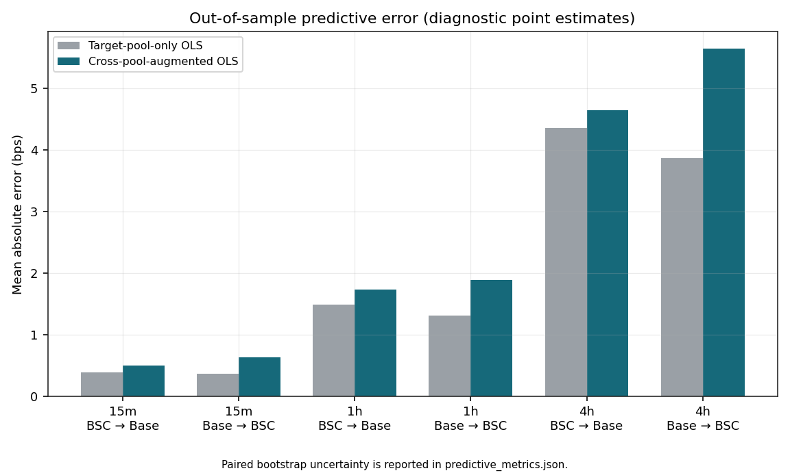
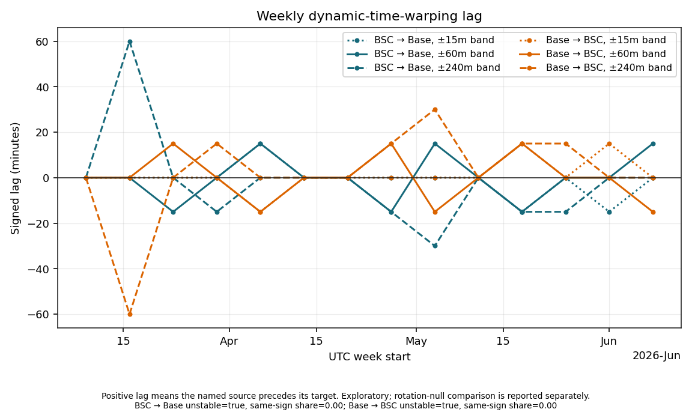
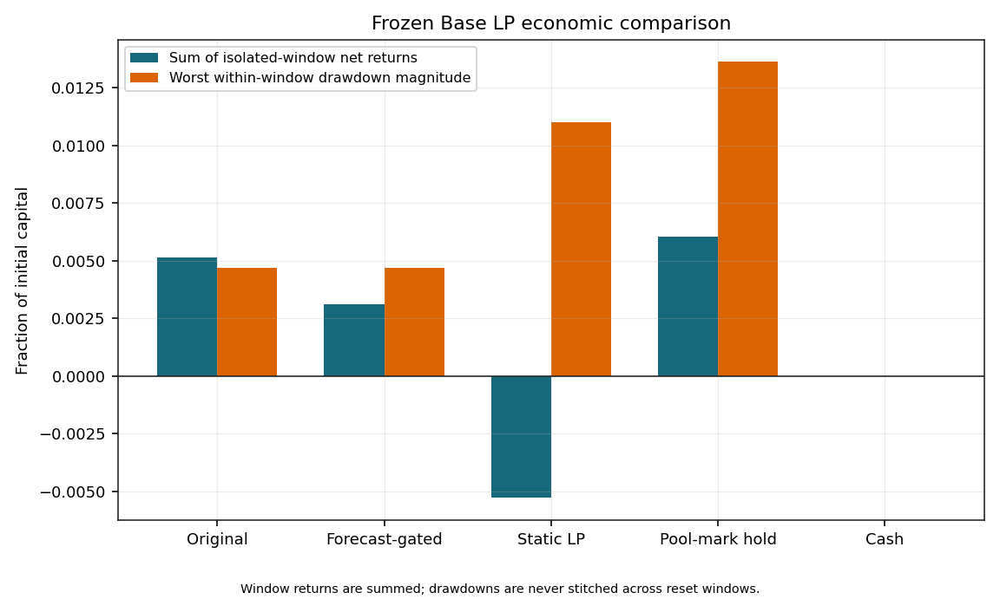
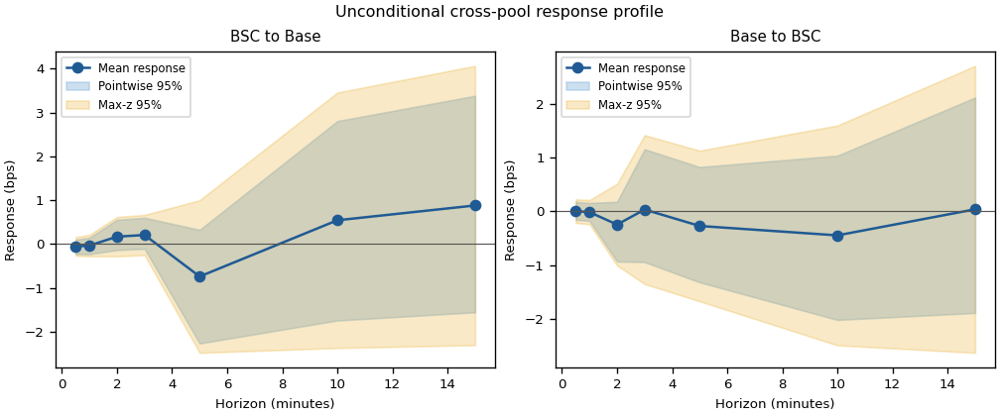
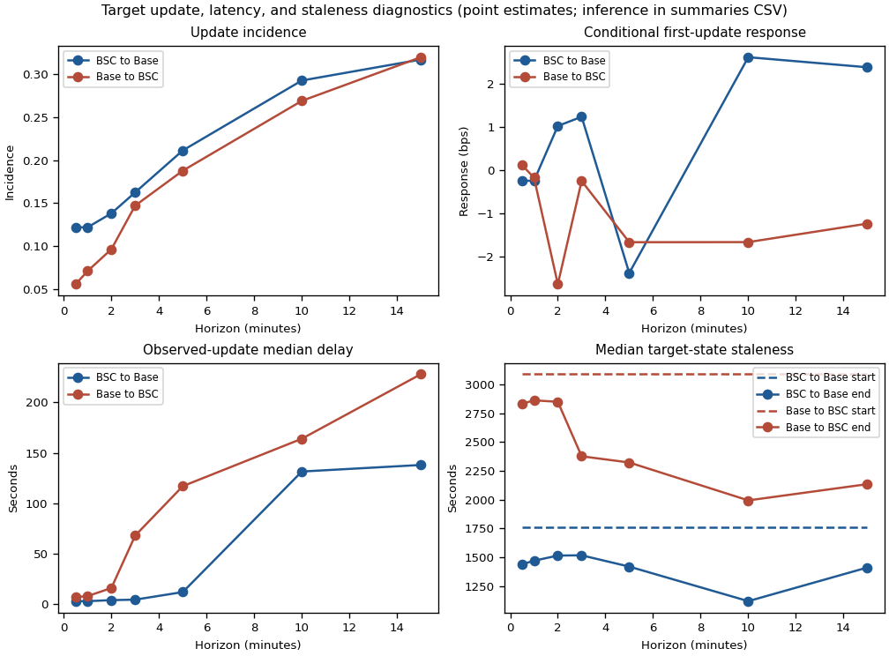
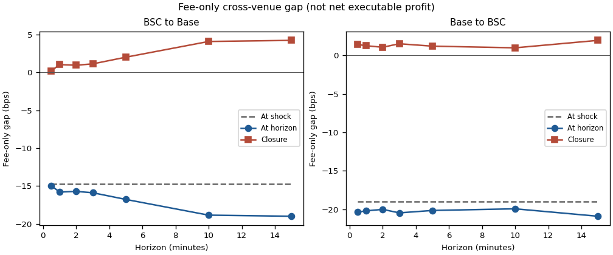

# CTO Final Research Brief: cNGN Market-Layer Research

Date: 2026-07-27

Status: internal decision note. The brief labels reviewed results, diagnostic
results, and results whose artifact files passed integrity checks separately.

## Decision headline

Keep every tested research policy out of live liquidity provision (LP),
arbitrage, routing, and capital-allocation decisions. The program produced
useful market measurements and several clean negative results. It did not
produce a promotion-grade Fair Price, a cross-pool leader, an improved LP gate,
or a valid weighted-portfolio performance claim.

The immediate work is to finish the article from the sealed evidence, improve
measurement quality, and preserve the failed gates. Further strategy research
needs new data or a corrected research contract.

## Result status

- **Pre-specified result:** cross-pool leadership is unresolved, and the locked
  LP gate did not improve net return.
- **Post-hoc exploratory extension, chosen after the parent test:** the
  seven-horizon response study adds timing and fee-gap measurements but does
  not change the pre-specified conclusion.
- **Weighted-portfolio result:** artifact files passed integrity checks, but the
  required claim gate failed, so no portfolio-performance result is reportable.

## Financial and statistical terms used below

One basis point is 0.01%. A move of 10 basis points, written 10 bps, is 0.10%.
Returns use the familiar formula `(ending value - starting value) / starting
value`. LP net return adds earned fees and the change in inventory value, then
subtracts modeled transaction costs.

A **markout** asks whether an execution price looks good after waiting. For a
buy, compare the later midpoint with the price paid now. A negative markout
means the buyer paid more than the later midpoint. Crossing a bid-ask spread can
create a negative markout even when nobody has a forecasting edge.

An **as-of price** is the newest recorded price available at or before a chosen
time. The code never waits for information from the future. This matters when
one pool updates less often than the other.

A **confidence interval** measures sampling uncertainty. The studies use a
**block bootstrap** that resamples whole UTC days 2,000 times. Resampling days
keeps same-day observations together instead of pretending every nearby event
is independent. A pointwise 95% interval covers one horizon. A simultaneous
max-z interval is wider because it protects the conclusion across all tested
horizons at once.

A **reset-capital window** starts each evaluation window with the same capital.
Window returns can therefore be compared and summed as isolated experiments.
They are not one continuously compounded live account.

## Program 1: Fair Price and centralized-exchange (CEX) execution

### Hypothesis 1: An independent fair-price label exists

The desired label was an external, timestamped cNGN value that could judge
Quidax and decentralized-exchange (DEX) prices without using either market as
its own answer key. The source search checked Binance `USDTNGN` history and the
small local Bybit P2P sample.

The overlap fetch found 255,846 Quidax rows and zero overlapping Binance
observations. Binance's last one-minute `USDTNGN` candle opened at
`2024-03-07T02:59:00+00:00`, almost two years before the 2026 pool histories.
The local Bybit sample contained 171 snapshots over roughly 13 hours and did not
cover the relevant LP validation edges.

Result: the acquisition test finished with a negative result. No independent
label exists for the research period, so no Fair Price estimator earned
promotion. DEX prices remain context and inventory marks because using them as
the truth label would make the test circular.

### Hypothesis 2: Quidax top book predicts its own next move

The Quidax file contains 255,846 dense rows, but 99.9605% repeat the previous
quote. Compressing duplicates leaves 99 complete quote states across 23 UTC
days. The analysis labels each state with the first valid midpoint observed 10
to 600 seconds later and resamples UTC days for inference.

The result was that every midpoint confidence interval included zero. The
sample therefore showed no reliable short-horizon directional edge. Buying at
the displayed offer or selling at the displayed bid produced negative
future-mid markouts at every horizon. For example, the state-based 10-second
means were -93.7 bps for buys and -90.4 bps for sells. Duration weighting,
which better represents a random arrival in clock time, put the cost near 21
bps per side.

The financial intuition is spread cost. A trader who crosses the book starts
behind the midpoint. The dataset contains no depth, order sizes, fills, or order
flow, so it cannot measure depth-walk execution or realized PnL.

### Hypothesis 3: DEX or blended anchors improve Quidax quoting

The proxy test compared three starting prices against future Quidax midpoint:
current Quidax midpoint, an equal-weight Base/BSC DEX price, and an equal-weight
blend. It used 83 states across 17 UTC days. Because the future label is Quidax,
this test measures closeness to Quidax's managed quote rather than independent
fair value.

At 10 seconds, DEX-proxy absolute error minus Quidax-anchor error was +54.5 bps
[37.0, 73.7]. Positive means the DEX proxy missed by more. The corresponding
60-second difference was +49.2 bps [32.9, 64.8]. At 600 seconds the difference
was -13.1 bps [-50.7, 26.8], which is unresolved because the interval includes
zero.

Result: the Quidax anchor best tracks future Quidax at short horizons. That is a
managed-quote diagnostic, not evidence that Quidax is independent fair value or
that a live anchor should change.

### Hypothesis 4: Quidax and the DEX pools broadly agree

The overlap check joined each DEX observation to the latest Quidax midpoint no
more than 15 minutes old. It used `sqrt_price_x96` as the canonical marginal
pool price and normalized both pools to stablecoin per cNGN. This normalization
handles the BSC pool's reversed token order, where USDT is token0 and cNGN is
token1.

There were 714 matched Base rows with a median DEX-minus-Quidax gap of -10.7 bps
and median absolute gap of 25.7 bps. There were 2,934 matched BSC rows with a
median gap of -7.7 bps and median absolute gap of 21.1 bps. About 95.7% of Base
matches and 99.4% of BSC matches were within 100 bps, while the tails reached
roughly 160 to 174 bps.

Result: the markets usually sat within tens of basis points of each other. This
supports DEX context and pool-mark accounting. It does not turn either DEX pool
into an independent Fair Price label.

## Program 2: DEX LP policies

### What the backtester simulates

A concentrated-liquidity market maker lets an LP place capital inside a chosen
price range. The range is stored as lower and upper **ticks**, the protocol's
discrete price coordinates. The inventory mix changes as the pool price moves
through that range. A narrow range concentrates more capital near the current
price and can earn a larger fee share there, but it leaves the position sooner
and can require more costly resets.

The simulator processes the actual pool-event sequence. On each swap it updates
the canonical `sqrt_price_x96` price, tick, active liquidity, and any rolling
statistics. A virtual position earns fees only while the current tick is inside
its range. Its fee share is `our liquidity / (pool liquidity + our liquidity)`;
fees are therefore diluted by the liquidity already competing at that price.
The simulator marks both tokens and accrued fees to the current pool price and
deducts entry, conversion, mint, removal, and exit costs. Base starts each
window with $1,200 and charges $0.073 to mint and $0.022 to remove; BSC starts
with $450 and charges $0.015 for each action. These are virtual, reset-capital
accounts, not a continuous live fund.

Existing positions are evaluated for exit before a new entry is considered,
and the code does not close and reopen on the same swap. All prices are
normalized to stablecoin per cNGN, including the BSC pool where USDT is token0
and cNGN is token1. This keeps an upward move economically consistent across
the two pools.

Three main comparators separate different sources of return: idle cash takes no
position; hold-cNGN measures inventory exposure at the same pool mark; and
passive static LP uses one of five fixed widths without active exits. The
frozen attribution also closes static LP to cash with terminal costs and routes
hold-cNGN through a same-pool entry and exit as a conservative lower bound.
Pool-mark hold is useful for attribution, but it is not an independent
fair-value benchmark.

### How the policy families work

**EWMA range LP.** An exponentially weighted moving average (EWMA) estimates a
recent center price and variance of log returns. The memory parameter
`lambda` controls how slowly old observations decay: 0.999 changes more slowly
than 0.95. The policy multiplies estimated volatility by a width parameter,
then uses `downside_skew` to divide that width below and above the center. It
can wait until price moves a configured distance beyond the range or exit
preemptively when price approaches a boundary. The next eligible swap can then
open a newly calculated range.

**Paper-style LP.** This policy starts with a fixed percentage range centered
on the latest spot price or the EWMA. It can close a position early, called a
harvest, after price moves a chosen fraction upward through the range, but only
when its profit threshold passes. It can also leave after a marked stop loss, a
configured downward move, or a move sufficiently outside the range.
Confirmation rules keep one noisy swap from forcing a defensive exit. In the
full grid, the profit test uses total return from one open-to-close position.
In the later directional version, fees net of modeled entry and exit costs must
clear the target, and total marked return after costs must also be positive.

The source is [Urusov et al., *Liquidity provision in CLMMs: evidence from
transactions data*](https://arxiv.org/abs/2604.22069) ([local
PDF](../literature/LPinginCLMMs.pdf)). The paper reconstructs real LP episodes
and reports that successful positions often close before the price traverses
their full range. Its Appendix A win score integrates normalized positive and
negative cumulative-profit areas over time, weighting both magnitude and
duration; 0.5 is neutral. Our backtester adapts that metric to a virtual
mark-to-market path and tests fixed ranges with early exits. It is not a
replication of the paper's population study: it does not reconstruct real
owners, token IDs, collections, or the paper's position taxonomy. EWMA ranges,
modeled costs, walk-forward selection, flow gates, and asymmetric directional
shapes are our additions.

**Directional paper-style LP.** For each of five predeclared profiles, a router
uses only features available at the validation-window entry to choose one of
three asymmetric fixed-range shapes, or stay in cash. It does not choose the
profile from later outcomes. `upside_capture` puts more width above the center
when past flow predicts a positive move. `fee_box` uses a tight range when fee
and volume conditions are high but predicted movement is nearly flat.
`dip_accumulator` keeps more width below the center during flat or down training
periods when flow or fees are high and the predicted move is non-negative.

### What grid search means here

A **grid search** evaluates every combination in a predeclared list of
hyperparameters. A hyperparameter is a rule chosen before simulation, such as
range width or stop loss, rather than a quantity learned inside one trade. The
search was deterministic: each candidate saw the same events and cost model.

| Family | Hyperparameters searched | Grid size |
| --- | --- | ---: |
| EWMA | volatility multiplier 0.50 to 3.00 by 0.25; `lambda` 0.95, 0.975, 0.99, or 0.999; downside skew 0.3 to 0.8; preemptive exit on/off; rebalance threshold 1%, 3%, 5%, 10%, or 15% | 2,640 EWMA combinations |
| Full paper-style | full width 0.25%, 0.5%, 1%, 1.5%, 2%, 5%, or 10%; spot/EWMA center; harvest after 4%, 6%, 8%, 10%, or 12% of range traversal; profit target 0.5% or 1%; stop -0.25%, -0.5%, -1%, or -2%; overshoot 0%, 2%, 5%, or 10% of range width | 2,240 paper-style combinations |
| Reduced paper-style | spot-centered width 0.25%, 0.5%, 1%, 1.5%, or 2%; profit target 0.5% or 1%; the same four stops; fixed 4% harvest, zero overshoot, one-swap confirmation, and spot exit | 40 reduced paper-style configurations |
| Directional | five profiles crossed with three archetypes; each shape varies center offset, lower and upper width, profit target, stop, and optional downward guard | 15 shapes |

The accompanying pre-trade signal test used signed flow over the prior 20, 50,
or 100 swaps to predict markouts 10, 25, or 50 swaps ahead, with an EWMA
coefficient memory of 0.94. Pre-trade flow excludes the current swap. At each
entry, the model uses only older examples whose future markout has already
occurred.

Grid size alone does not establish a winner. Base used 200 training swaps
followed by 50 validation swaps; BSC used 300 followed by 75. Moving forward by
one validation block produced 26 Base windows and 37 BSC windows. In each
window, every candidate was ranked on the earlier slice by `net return -
maximum drawdown + 0.001 x capped log(fees / transaction costs)`. The small
fee/cost term rewards fee income that can pay for position management without
overriding return and drawdown. The top 100 training candidates were replayed
on the next validation slice. A separate matrix evaluated every configuration
in every validation window for the probability-of-backtest-overfitting check.

### Hypothesis 5: Full-grid DEX LP selection produces a deployable policy

The **rank-1 stream** joins the best training candidate from each window, so it
is a sequence of decisions rather than one fixed tuple. Parameter choices were
unstable: the 26 Base windows selected 26 distinct EWMA tuples and 19 distinct
paper tuples; the 37 BSC windows selected 25 distinct EWMA tuples and 19
distinct paper tuples. There is therefore no single strongest full-grid
configuration to report.

All four rank-1 streams failed the deployment test: Base paper -0.460%, Base
EWMA -1.256%, BSC paper -2.086%, and BSC EWMA -1.755%. Each selected stream had
an out-of-sample-loss probability of 1.000: in every partitioned check, the
configuration selected on earlier windows had a negative average return on the
held-out windows. The full-grid selection procedure failed the post-cost
deployment gate.

### Hypothesis 6: A directional LP policy transfers across pools

After rejecting full-grid selection, the study tested a smaller predeclared
paper family and compared five directional profiles. The strongest retained
diagnostic was `upside_tight_v1` under `gate_strict_qts_20_25`, the strict
positive-20/25-markout gate. It opens only when the training-window cNGN return
is non-positive, the entry flow reading is at or above the 90th percentile of
its historical distribution available at entry, and a causal model based on
the prior 20 swaps predicts a positive move over the next 25 swaps.

Every active window selected the profile's `upside_capture` shape. It shifts
the center +0.125%, places 0.25% below and 0.75% above that center, harvests
after price traverses 4% of its range and reaches a +0.5% fee return after
costs while total marked return remains positive, and uses a -0.25% stop. It
exits as soon as an out-of-range move qualifies, uses one-swap defensive
confirmation, and marks the exit at spot. These are the exact hyperparameters
carried into the last directional backtest.

The diagnostic policy returned +1.039% across four active Base windows. Its
worst window was +0.118%, all four windows were positive, and it beat pool-mark
hold by 0.228 percentage points. The identical gate and profile returned
-1.272% across seven BSC windows; its worst window was -0.842%, only 14.3% of
windows were positive, and it trailed hold by 1.602 percentage points.

“Strongest” means the best recorded Base slice among the small predeclared
directional profiles and gates. It was not tested on a separate, later holdout
after that selection, covers only four Base windows, depends on an internal
pool mark, and fails on the BSC falsification pool. It is a diagnostic finding
about pool behavior, not a deployable winner.

## Program 3: Cross-pool information transfer

### Hypothesis 7: One pool improves forecasts of the other

The reviewed parent experiment built causal as-of panels from normalized
`raw_sqrt_mid` prices. It trained expanding weekly regressions after a 14-day
warmup. The baseline used only the target pool's history; the augmented model
added the other pool. The one-hour horizon was primary, with 15-minute and
four-hour sensitivity checks.

Forecast error is measured with **mean absolute error** (MAE), the average of
`abs(predicted move - actual move)`. The reported improvement equals target-only
MAE minus cross-pool MAE. A positive number would mean the other pool reduced
forecast error.

For BSC to Base, cross-pool MAE was 1.73230 bps versus 1.49063 bps for the
target-only model. The BSC-to-Base MAE difference was -0.241675 bps (95%
[-0.289590, -0.198156]). For Base to BSC, cross-pool MAE was 1.88965 versus
1.30241 bps; Base-to-BSC was -0.587238 bps (95% [-0.734881, -0.466305]). Both
reviewed evidence classes are `inconclusive`. The full decision contract also
considers directional accuracy, sensitivity, influence, and alignment
stability, so worse MAE alone does not authorize an affirmative no-lead claim.

*How to read the graph:* gray bars are target-only MAE; teal bars add the other
pool. Lower is better. The teal bar is taller at every shown horizon and
direction. The chart shows point estimates; the day-bootstrap intervals and
decision classes live in the reviewed manifest.

### Hypothesis 8: Event responses and time alignment identify a leader

The event study asks what the target pool's as-of price does after a predefined
source-pool shock. The parent study measured 15-minute, one-hour, and four-hour
responses. The 15-minute unconditional means were +0.878230 bps for BSC to Base
and +0.039554 bps for Base to BSC, with both intervals spanning zero.

The **dynamic time warping** method aligns two noisy paths while allowing
bounded timing shifts. A positive signed lag means the named source tends to
move first. The primary band had zero aggregate signed minutes in both
directions. Weekly lags changed sign and magnitude when the allowed alignment
band changed, so the result is band-unstable. The observed paths aligned better
than all 84 rotated null paths, but low alignment cost indicates that the series
co-move; it does not identify a stable leader.

*How to read the graph:* each line uses a different allowed timing band. Points
above zero favor the named source leading; points below zero favor the reverse.
The sign changes across weeks and bands. That instability blocks a directional
claim.

### Hypothesis 9: A cross-pool forecast gate improves LP returns

The frozen economic test held the Base LP policy, costs, and 23 reset-capital
windows fixed. It changed one thing: the gated version could enter only when the
one-hour cross-pool forecast agreed with the original policy. This isolates the
economic value of the forecast gate.

Aggregate net return was +0.515% for the original policy and +0.310% for the
gated policy. The gated worst window was -0.096%, versus -0.009% for the
original. Worst within-window drawdown was unchanged at 0.468%. The reviewed
economic class is `no_net_return_improvement`.

*How to read the graph:* teal bars sum isolated-window net returns. Orange bars
show the largest within-window drawdown as a positive magnitude, so shorter is
better. The gate lowered return without lowering drawdown. Pool-mark hold is a
diagnostic inventory comparator, not an external fair-value benchmark.

### Hypothesis 10: Short-horizon reactions reveal a leader or fee opportunity

The reviewed extension reuses the parent shock set at seven horizons from 30
seconds to 15 minutes. It separates three questions that are easy to conflate.

An **unconditional response** measures the target pool's recorded state change
after every eligible shock. If no new target observation arrived, the same
as-of price appears at the start and end, so the observation contributes a
valid zero response. This describes the full shock sample.

A **conditional response** measures the first target update only among shocks
where the target produced an observed update. Shocks without an update are
excluded from this average. The conditional number therefore describes a
selected subset and cannot replace the market-wide unconditional number.

The **update incidence** is the share of eligible shocks with an observed target
update before the horizon. At 15 minutes, BSC to Base incidence was 39/123
(31.7%), and Base to BSC was 63/197 (32.0%). Put differently, about two-thirds
of shocks had no recorded target update within 15 minutes. Those 84/123 and
134/197 cases are **right-censored**: the data only say the first update was not
seen before the cutoff. Right-censoring is not a conditional zero and not a
survival estimate of the true update time.

The pointwise 95% intervals show how uncertain the unconditional averages are:

| Direction | 3-minute response | 15-minute response |
| --- | ---: | ---: |
| BSC to Base | +0.204359 bps [−0.108480, +0.598811] | +0.878230 bps [−1.559177, +3.381749] |
| Base to BSC | +0.035202 bps [−0.941110, +1.156460] | +0.039554 bps [−1.886550, +2.117268] |

At 15 minutes, the conditional first-update means were +2.382769 bps and
-1.237692 bps for BSC to Base and Base to BSC. The BSC-to-Base conditional
number comes from 39 observed updates, not all 123 shocks. Median
observed-update delays were 138 and 228 seconds. State-age readings measure data
freshness; they do not prove the latent market itself was inactive.

*How to read the graph:* blue points are unconditional means. Blue shading is a
pointwise interval; amber shading protects all seven horizons together. All
unconditional simultaneous max-z bands include zero, so the graph does not
resolve a leader.

*How to read the graph:* the upper-left panel is incidence. The upper-right is
the conditional first-update response for the selected updated subset. The
lower panels show observed-update delay and state age. These are point estimates
only; inferential intervals are stored in the reviewed summaries and manifest.

The fee-only test applies both pool fees under a USDC/USDT parity assumption.
It excludes gas, slippage, fillability, inventory limits, delay, and stablecoin
basis, so it is not net executable profit. At 15 minutes, the BSC-to-Base signed
gap moved from -14.774555 to -19.003638 bps; Base to BSC moved from -18.949015
to -20.881117 bps. The red start-minus-end differences are +4.229084 and
+1.932103 bps. Both end gaps are more negative, so a positive red value does not
mean the gap closed toward zero or produced profit.

*How to read the graph:* dashed lines show the mean signed gap at the shock;
blue lines show the mean at each horizon; red lines show start minus end. The
red line is signed arithmetic, not an executable return.

### Hypothesis 11: Girum's magnitude pattern replicates

Girum reported +3.4 bps Base to BSC and +0.4 bps BSC to Base. The reviewed
extension found +0.035202 and +0.204359 bps in the same order. Both signs are
positive, but the magnitude ordering reverses. The studies use different shock
rules, samples, clustering, and inference, so the comparison does not
corroborate Base leadership. The reviewed parent result is the current decision
basis; the older memo is historical comparison only.

## Program 4: Joint portfolio accounting

### Hypothesis 12: Joint portfolio allocation supports a performance claim

The joint-accounting implementation puts many LP positions into one accounting
system. This is necessary because two individually valid positions can compete
for the same capital or create overlapping inventory. The run covered 4,895
canonical economic units over 26 Base windows and 37 BSC windows.

**Probability of backtest overfitting**, or PBO, measures selection risk. It
splits observations into different train/test partitions and asks whether a
choice that ranks well in-sample keeps its rank out of sample. PBO is not a
return and cannot repair missing portfolio paths.

The candidate reset matrices were complete. The allocation-rule reset matrices
were invalid and incomplete, and carried-capital paths were path-dependent, so
they were not eligible for the same PBO calculation. Package integrity passed
for both packages, but the default claim gate failed for both. Therefore no
weighted-portfolio performance result is reportable. Candidate-level PBO,
selected returns, or carried-path cells cannot substitute for the failed
portfolio claim.

## Failed or unfinished hypotheses

These items require genuinely new data or a corrected analysis contract locked
before results are inspected:

- **Promotion-grade Fair Price and executable CEX PnL:** blocked by missing
  independent overlap, depth, fills, and order sizes.
- **Depth-walk, imbalance, OWA, microprice, and fill-probability tests:** the
  available Quidax history contains top book only.
- **LP capacity, dynamic sizing, and live promotion:** blocked by the missing
  non-pool inventory comparator and limited transfer evidence.
- **Portfolio-level allocation-rule PBO and performance:** blocked by the
  incomplete allocation-rule reset matrices.
- **Causal price discovery, toxic-flow attribution, and external-LP
  profitability:** none of the completed studies identifies these mechanisms.

## Recommended decisions

1. **No deployment decision:** make no live LP, routing, arbitrage, Fair Price,
   or portfolio-allocation change from this program.
2. **Fund measurement:** collect timestamped independent prices, executable
   depth, fills, state age, gas, slippage, and stablecoin basis.
3. **Keep portfolio research separate from live decisions:** preserve the
   failed claim gate and repair the allocation-rule matrix contract before any
   new evaluation.
4. **Finish the article from the sealed evidence:** publish the methods, exact
   aggregate results, and negative findings without operational policy details.

## Claim boundary

The evidence does not support claims of causal price discovery, a unique
directional leader, deployable alpha, toxic-flow attribution, external-LP
profitability, net executable profit, or a definitive no-lead finding.

## Evidence ledger

- Parent reviewed manifest:
  `research/results/cross_pool_lead_lag/article_manifest.json`, SHA-256
  `adf4fd71fd33604cee70fcba7aa90d2b7763715d3cba68a868d26347c599abfe`.
- Parent predictive, DTW, and LP figures: SHA-256
  `a8badb8f809545597d9c2d712971bf2d8fa352cfc51205d21fa652ea936c812f`,
  `3c9d79a12983f4eee6e7c083cf2e76af5701dbf9c6e0025a9c7298ab9a0f81ac`,
  and
  `a18468cb4e4016dfbb72853d047a6e0e748bfcc1392e69ec86a2cd24354785ab`.
- Reviewed short-horizon manifest:
  `research/results/cross_pool_short_horizon_v1/short_horizon_manifest.json`,
  SHA-256
  `9145738bb6dd4aa84512b3f62625d779e6e4ef223f5b614e1f9facc502ab7509`.
- Short-horizon response, update, and fee-gap figures: SHA-256
  `2ef9ec2b7da282dccc2bd0ac4dc6f706b393298389620deca3b2f9ef26d5f99a`,
  `7efeae4b654f55137de04186640b7d3b5674f0663fbd9d3205526bbc59172433`,
  and
  `ff2fe442578bd04bfbd6cb099cb2d01d19f6c118cba1e921c65e64be57b2e09c`.
- Base and BSC portfolio manifests: SHA-256
  `6ce68fa8c0a05cb6339d223e9558aa9f5a425a5205de6d5b8bdddce252241ac4`
  and
  `81c3f01c496f137dcaf1eb7c25b425b05eb5c93adc08fd20f5397cedcf893dc7`.
- Sealed article evidence pack:
  `research/articles/evidence-pack-2026-07-cngn-market-making.md`, SHA-256
  `50737e3c513b100f6d1907777f2da6fa71df485793fdaf1694ed3f61b55fe8bf`.
